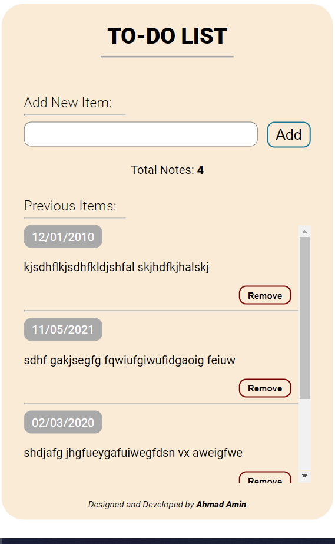

Hello, This is Ahmad Amin.
I had completed another project using JavaScript Library i.e. React.js. This is a simple Todo list application, where you can simply add and remove the items from the list with the beautifull minimalist design.
The front design is below:

I used simple states (in classful components for the state managment). Things that I am managing in the state are:
1. Total items in the list [an array of Object]
2. The new Input entered by the user

You can check it out yourself at https://ahmad-amin.github.io/TO-DO-list-React/

Regards
Ahmad Amin
